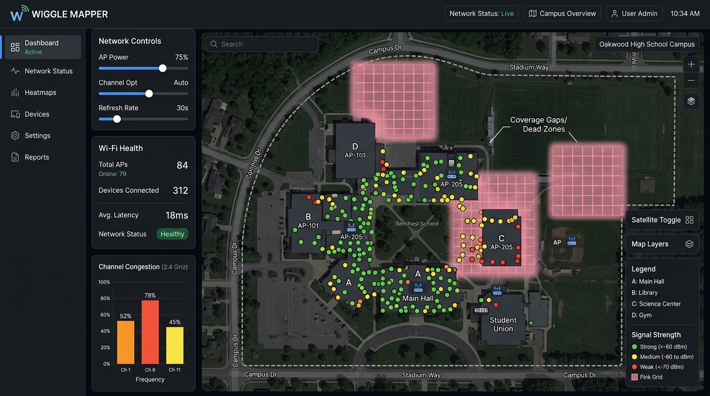

# Wiggle Mapper: School Wi-Fi Coverage & Interference Analyst

Wiggle Mapper is a lightweight, zero-install, single-page web application (SPA) designed to help schools, teachers, and students map Wi-Fi coverage, identify dead zones, and analyze wireless frequency interference. 

The application runs entirely in the browser—requiring **no backend server, no database, and no API keys** (using open-source Leaflet maps). Users simply drag-and-drop WiGLE CSV export files collected by students using their mobile devices.



---

## 🛠️ Features

*   **Multi-File CSV Imports:** Drag and drop multiple WiGLE CSV scans at once.
*   **Target SSID Filtering:** Focus analysis on the school network (or any specific SSID) with a single click.
*   **Frequency Band Filtering:** Toggle between 2.4 GHz and 5 GHz bands to compare coverage.
*   **Multi-Layer Visualizations:**
    *   *Raw Points:* Individual recorded coordinates color-coded by signal strength (dBm).
    *   *Grid Aggregation:* Smooth averages mapped into configurable grid cells (from 2m to 20m).
    *   *Signal Heatmap:* A continuous density overlay highlighting coverage focus.
    *   *Needs Scanning (Pink Grid):* Translucent pink blocks highlighting under-sampled or unscanned areas within the campus.
*   **Interactive Campus Boundary Tool:** Draw custom polygons directly on the map to define the school perimeter and isolate coverage/gap stats.
*   **Real-Time Diagnostics Panel:**
    *   *Dead Zone Area %:* Percentage of campus with weak (<= -76 dBm) or zero signal coverage.
    *   *Channel Utilization Chart:* Dynamic bar chart showing channel congestion, flagging crowded standard channels (1, 6, 11).
    *   *Actionable Alerts:* Automated warnings like high channel congestion or large coverage gaps.
*   **Load Demo Campus:** Generate mock school coordinate tracks and scan data to test and demonstrate all features instantly.
*   **Save/Load Projects:** Export boundaries and parsed data as a `.json` configuration file to save and resume work later.

---

## 📂 Repository Structure

```text
wiggle_mapper/
├── index.html                   # Main single-page web application
├── README.md                    # Project overview & documentation
└── docs/
    ├── student_guide.md         # Student instructions for WiGLE scanning
    ├── teacher_lesson_plan.md   # 3-Day curriculum & career mappings
    └── images/
        └── wiggle_mapper_preview.jpg  # Preview screenshot of the application
```

---

## 🚀 Getting Started

### 1. Running the Web App
Because the app is built as a pure client-side page, there is no compile or install phase:
*   **Option A (Direct Run):** Double-click `index.html` to open it in any web browser.
*   **Option B (Simple Web Server):** To serve it locally over a network, open a terminal in the folder and run:
    ```bash
    python3 -m http.server 8000
    ```
    Then visit `http://localhost:8000` in your browser.

### 2. For Teachers (Lesson Plan)
Integrate Wiggle Mapper into a Middle School or High School science, math, or computer science class.
*   Review the [Teacher Lesson Plan](docs/teacher_lesson_plan.md) for a complete 3-day curriculum, grading alignment, and information on high-demand technology careers.

### 3. For Students (Data Collection)
Prepare students to gather Wi-Fi logs around campus using their phones.
*   Distribute the [Student Guide](docs/student_guide.md) to walk them through downloading the free **WiGLE Wi-Fi** app, configuring settings, performing scans, and exporting logs.

---

## 🛜 Understanding Wi-Fi Signal Strength (dBm)
The map colors points based on the standard decibel-milliwatts (dBm) scale:
*   🟢 **Excellent (>= -60 dBm):** Extremely fast, strong, and stable connection.
*   🟡 **Weak / Fair (-61 to -75 dBm):** Usable, but slower speeds and possible buffering.
*   🔴 **Dead Zone (<= -76 dBm):** Constant dropouts or complete loss of internet connection.

---

## 🗺️ Open Source Libraries Used
*   **Leaflet.js:** Open-source interactive map rendering.
*   **Leaflet.heat:** Spatial heatmap plugin.
*   **PapaParse:** Fast, browser-based CSV parsing.
*   **Chart.js:** HTML5 canvas charting.
*   **Tailwind CSS:** Modern utility-first CSS framework.
*   **Lucide Icons:** Open-source frontend icon toolkit.
