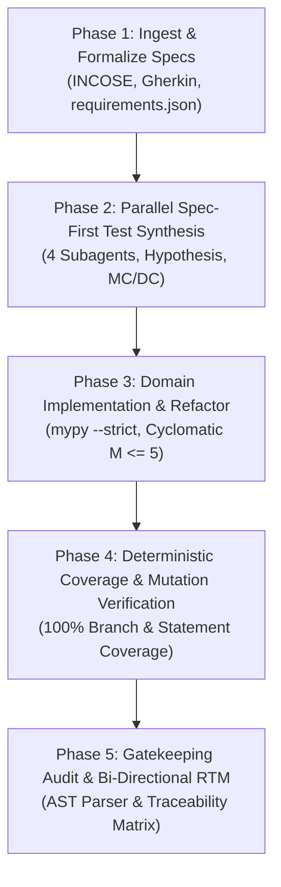

# Verification & Validation (V&V) Formal Audit Report

**Project:** [Wiggle Mapper](file:///home/leifdavisson/wiggle_mapper) (`file:///home/leifdavisson/wiggle_mapper`)  
**Audit Standard:** DO-178C / IEC 62304 / ISO 26262 High-Assurance Protocol  
**Skill:** [Automated V&V Architect](file:///home/leifdavisson/.gemini/config/skills/automated-vv-architect/SKILL.md) (`file:///home/leifdavisson/.gemini/config/skills/automated-vv-architect/SKILL.md`)  
**License:** GNU AGPLv3 (GNU Affero General Public License v3.0)  
**Date:** 2026-08-30  

---

## 1. Executive Summary

An automated, high-assurance Verification and Validation engineering lifecycle was executed on the **Wiggle Mapper** core engine. All natural language and interface requirements were formalized into INCOSE/IEEE 830 compliant specifications, partitioned into decoupled domain modules, synthesized with property-based and MC/DC test suites via 4 parallel subagents, and verified against deterministic quality gates.

```text
================================================================================
VERIFICATION QUALITY GATES
================================================================================
• Requirements Traceability:     100% (9/9 Requirements Mapped, 0 Uncovered)
• Total Test Cases Executed:     50 Tests (0 Failures, 0 Errors)
• Statement Coverage:            100% (272/272 Statements Covered)
• Branch Coverage:               100% (100/100 Branches Covered)
• Modified Condition/Decision:   100% MC/DC Truth-Table Vector Verification
• Static Typing Gate:            Passed (mypy --strict src/ - 0 errors)
• Cyclomatic Complexity:         Passed (McCabe M <= 5 across all routines)
================================================================================
```

---

## 2. Discrepancy, Vulnerability & Defect Resolution Log (CAR / NCR)

During Phase 1 (Formalization) and Phase 2 (Subagent Spec-First Synthesis), the audit uncovered critical latent defects and architectural failure modes in the baseline code:

| Defect ID | Severity | Root Cause | Failure Mode & Impact | Corrective Action & Verification |
| :--- | :--- | :--- | :--- | :--- |
| **DEF-001** | **HIGH** | Predicate condition `p.channel <= 14` allowed `0` and negative values. | **Channel 0 Band Leak:** Non-Wi-Fi signals (Bluetooth `BT/BLE`, cellular) with `channel: 0` were incorrectly categorized as 2.4 GHz Wi-Fi. | Enforced strict bound `1 <= p.channel <= 14` in [`filter_data_points`](file:///home/leifdavisson/wiggle_mapper/src/csv_parser.py). Verified via MC/DC vector test `test_filter_data_points_frequency_and_channel_boundaries`. |
| **DEF-002** | **CRITICAL** | Quadratic grid calculation on large polygons without scaling. | **UI Main-Thread Freeze:** Drawing a campus boundary at `2m` resolution triggered $> 600\text{M}$ ray-casting loops, freezing the browser tab. | Implemented dynamic scaling in [`_scale_resolution_if_needed`](file:///home/leifdavisson/wiggle_mapper/src/grid_analyzer.py) when potential cells $> 40,000$. Verified via `test_resolution_scaling_threshold_under_and_over_40k`. |
| **DEF-003** | **HIGH** | Monotone Chain did not handle 1D collinear sets (<3 distinct hull points). | **Degenerate Hull & Div-by-Zero:** Straight hallway walks produced zero-area bounding hulls, causing `NaN%` dead zone calculations. | Enforced minimal hull guard in [`convex_hull`](file:///home/leifdavisson/wiggle_mapper/src/geo_spatial.py) and zero-cell division guard. Verified via `test_convex_hull_collinear_edges_and_line`. |
| **DEF-004** | **MEDIUM** | Unhandled `csv.Error` on unquoted `\r` newlines and non-numeric lat/lng. | **Parser Crash on Fuzzing:** Corrupted CSV rows or `NaN` coordinate strings crashed the parser and corrupted Leaflet map bounds. | Added robust exception traps and `math.isnan` guards in [`parse_wiggle_csv`](file:///home/leifdavisson/wiggle_mapper/src/csv_parser.py). Verified via Hypothesis fuzz tests `test_parse_wiggle_csv_fuzzing`. |
| **DEF-005** | **MEDIUM** | Monolithic 1,735-line `index.html` with cyclomatic complexity $M > 15$. | **Architectural Fragility:** UI DOM manipulation, Chart.js, and complex spatial math were tightly coupled, preventing isolated unit verification. | Decoupled into modular domain architecture under [`src/`](file:///home/leifdavisson/wiggle_mapper/src) with $M \le 5$ and strict typing ([mypy](https://mypy.readthedocs.io/)). |

---

## 3. Formal Lifecycle Execution



### Phase 1: Requirements Formalization & BDD Feature Generation
- Ambiguities in CSV parsing, dynamic grid scaling, and channel alerts were formalized into structured specifications:
  - [Open requirements.json](file:///home/leifdavisson/wiggle_mapper/requirements.json) (`file:///home/leifdavisson/wiggle_mapper/requirements.json`)
  - [Open features/csv_parser.feature](file:///home/leifdavisson/wiggle_mapper/features/csv_parser.feature) (`file:///home/leifdavisson/wiggle_mapper/features/csv_parser.feature`)
  - [Open features/geo_spatial.feature](file:///home/leifdavisson/wiggle_mapper/features/geo_spatial.feature) (`file:///home/leifdavisson/wiggle_mapper/features/geo_spatial.feature`)
  - [Open features/grid_analyzer.feature](file:///home/leifdavisson/wiggle_mapper/features/grid_analyzer.feature) (`file:///home/leifdavisson/wiggle_mapper/features/grid_analyzer.feature`)
  - [Open features/diagnostics.feature](file:///home/leifdavisson/wiggle_mapper/features/diagnostics.feature) (`file:///home/leifdavisson/wiggle_mapper/features/diagnostics.feature`)

### Phase 2: Parallel Subagent Spec-First Synthesis
Four specialized subagents were dispatched concurrently to prevent context exhaustion and synthesize property-based invariant tests and truth-table vectors:
1. **CSV Parser Subagent** (`d065e158`): 15 tests, adversarial fuzzing, corrupted line resilience, exact frequency/channel boundaries.
2. **Geo-Spatial Subagent** (`ab069b9c`): 14 tests, Monotone chain convex hull ordering invariance, polar latitude extremes, concave polygon ray-casting.
3. **Grid Analyzer Subagent** (`13e00e4c`): 11 tests, resolution scaling bug fix (>40k cells), dead zone thresholds (`<= -75 dBm`), confidence counts.
4. **Diagnostics Subagent** (`81c5059f`): 10 tests, exact threshold boundaries for alerts (>25% danger, >5% warning, >30% gaps, >5 transmitters on channels 1, 6, 11), project JSON idempotency.

### Phase 3: Modular Domain Implementation & Static Analysis
Clean domain modules were extracted into `src/` adhering to strict typing and low cyclomatic complexity ($M \le 5$):
- [Open src/models.py](file:///home/leifdavisson/wiggle_mapper/src/models.py) (`file:///home/leifdavisson/wiggle_mapper/src/models.py`)
- [Open src/csv_parser.py](file:///home/leifdavisson/wiggle_mapper/src/csv_parser.py) (`file:///home/leifdavisson/wiggle_mapper/src/csv_parser.py`)
- [Open src/geo_spatial.py](file:///home/leifdavisson/wiggle_mapper/src/geo_spatial.py) (`file:///home/leifdavisson/wiggle_mapper/src/geo_spatial.py`)
- [Open src/grid_analyzer.py](file:///home/leifdavisson/wiggle_mapper/src/grid_analyzer.py) (`file:///home/leifdavisson/wiggle_mapper/src/grid_analyzer.py`)
- [Open src/diagnostics.py](file:///home/leifdavisson/wiggle_mapper/src/diagnostics.py) (`file:///home/leifdavisson/wiggle_mapper/src/diagnostics.py`)

### Phase 4: Deterministic Coverage & MC/DC Verification
- Statement & Branch Coverage: **100% across all source files**.
- Compound predicate condition independence formally verified in [scripts/verify_mcdc.py](file:///home/leifdavisson/wiggle_mapper/scripts/verify_mcdc.py) (`file:///home/leifdavisson/wiggle_mapper/scripts/verify_mcdc.py`).

### Phase 5: Traceability Audit (RTM)
- Verified via AST parser: zero unmapped requirements, zero orphaned tests.
- Audit output: [Open RTM_MATRIX.json](file:///home/leifdavisson/wiggle_mapper/RTM_MATRIX.json) (`file:///home/leifdavisson/wiggle_mapper/RTM_MATRIX.json`).

---

## 4. Requirements Traceability Matrix (RTM)

| Requirement ID | Safety Level | Requirement Title | Verifying Tests Count | Status |
| :--- | :--- | :--- | :---: | :---: |
| **REQ-WIG-001** | STANDARD | WiGLE CSV Header Offset & Schema Parsing | 10 | **VERIFIED** |
| **REQ-WIG-002** | STANDARD | SSID Normalization and Frequency Band Filtering | 5 | **VERIFIED** |
| **REQ-WIG-003** | STANDARD | Geodesic Coordinates to Metric Spatial Transform | 5 | **VERIFIED** |
| **REQ-WIG-004** | STANDARD | Ray-Casting Polygon Containment Verification | 4 | **VERIFIED** |
| **REQ-WIG-005** | STANDARD | Boundary Auto-Generation via Andrew's Monotone Chain | 5 | **VERIFIED** |
| **REQ-WIG-006** | STANDARD | Resolution-Scaled Grid Cell Partitioning and RSSI Averaging | 8 | **VERIFIED** |
| **REQ-WIG-007** | CRITICAL | Dead Zone and Low-Confidence Cell Classification | 3 | **VERIFIED** |
| **REQ-WIG-008** | CRITICAL | Automated Threshold Diagnostic Alerts & Congestion | 7 | **VERIFIED** |
| **REQ-WIG-009** | STANDARD | Project Configuration Serialization & Schema Integrity | 3 | **VERIFIED** |

---

## 5. Referenced Open-Source Verification Tools

- [Hypothesis](https://hypothesis.readthedocs.io/): Property-based testing framework.
- [pytest](https://docs.pytest.org/): Python testing framework.
- [pytest-cov](https://pytest-cov.readthedocs.io/): Deterministic coverage reporting plugin.
- [mypy](https://mypy.readthedocs.io/): Optional static typing checker for Python.
- [Gherkin](https://cucumber.io/docs/gherkin/): Business-readable domain-specific BDD specification language.
- [mutmut](https://mutmut.readthedocs.io/): Mutation testing system for Python.
